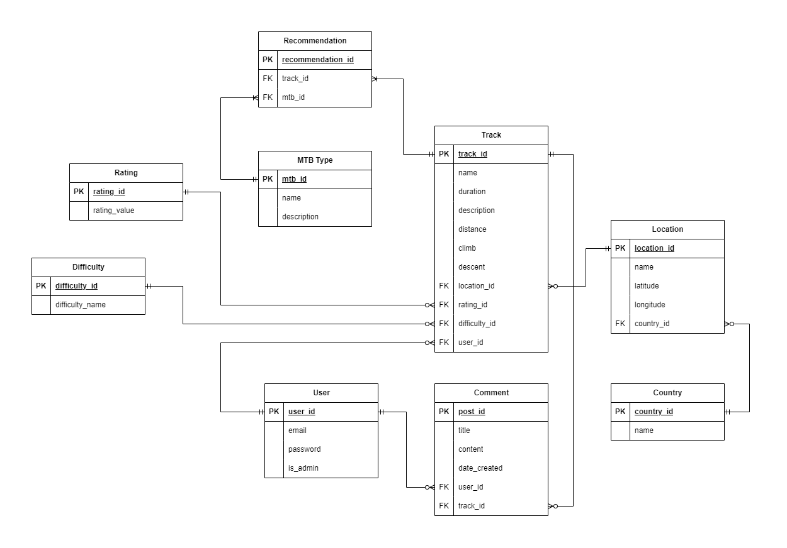

# Planning Documentation

Written by Jeevan Ng 

# Overview 

This application will serve as a centralised platform for mountain biking enthusiasts to access comprehensive information about single track routes across the globe. 

# The Problem (R1)

Currently, the problem at hand is the lack of centralised platforms to access comprehensive information about mountain bike single track routes across the world. 

By creating an application with an API and a database, users can easily find suitable tracks based on their mountain bike type no matter where they are in the world. Whether they are on holiday overseas or looking for new tracks in their town, users will be able to find tracks and additional information (track descriptions, distance, duration etc.) at the tip of their fingers in one place. 

This application will aim to provide a centralised, user friendly and reliable hub for the mountain biking community. 

# Why is it a problem that needs solving? (R2)

This is a problem that needs solving as mountain bike enthusiasts are currently relying on various sources like online forums, word-of-mouth, magazines, websites and other applications to find information about tracks local to them. 

It is also incredibly difficult to find information on single track routes when travelling overseas. This is especially true since the information on forums, magazines and websites may be in a language that the user does not understand. 

Currently, the closest centralised application that exists is *Trailforks*, however, our application aims to provide unique features, enhanced functionalities and a better user experience. *Trailforks* is a clunky application and can be difficult to navigate when trying to find information on tracks. 

We have identified that mountain bike enthusiasts want a user friendly centralised platform to access all their mountain biking needs. They also wish to search tracks via different filters. This application aims to offer exactly that with added functionalities like the ability to populate a list of tracks that would be suitable to ride depending on the type of mountain bike. Further down the line, filters will be added to allow users to search for tracks by difficulty, duration, descent, climb etc. This functionality is currently not supported by *Trailforks*. 

# Why have you chosen this database system? What are the drawbacks? (R3)

The chosen database system is postgreSQL. PostgreSQL is a relational database management system which will best represent our data. It is one of the  most popular open-source relational databases known for it's robustness and has a large amount of active open-source contributors offering a built-in community support network. Being open-source, there are no licensing costs involved with using PostgreSQL which is a huge cost benefit as we are in the initial stages of developing our application. 

PostgreSQL supports international characters (if needed in the future) and is highly scalable in the quantity of data it can manage. This will helpful as this application develops further down the line as we will be adding hundreds of locations around the world with even more tracks. 

PostgreSQL is ACID (atomicity, consistency, isolation and durability) compliant, which basically ensures database transactions are processed reliably and consistently. The principles relate to transactional processing and are crucial for maintaining data integrity and recoverability in a predictable manner.

PostgreSQL has a large list of features such as support for a huge number of data types (numeric, boolean, datetime etc.), geometric types, monetary types and much more. PostgreSQL also supports spatial data which may be extremely beneficial further down in development as the ability to implement maps, contour lines and topographical images will be extremely attractive to users. 

Some of the drawbacks of PostgreSQL is that installation is complex and may prove challenging for beginners. The various complex features require more knowledge and expertise, and consequently for large scale deployments more training will be involved for the use of PostgreSQL in comparison to other simpler database systems. 

Another drawback is that PostgreSQL does not support horizontal scaling. This limitation means that as the load increases on PostgreSQL, there is no ability to distribute the workload across multiple machines (horizontally) to improve speed, efficiency and performance (Rathbone, 2023). As our application grows, we may need to look into other options that offer horizontal scaling, however, for the initial stages this will not be an issue. 

PostgreSQL also has limited noSQL features, which means that large amounts of unstructured data, such as data generated by social media (Rathbone, 2023), will not be able to be processed and stored. In the future our application will rely on user generated data for updates to tracks, new locations and foster a community that constantly contribute to the growth of the application. NoSQL's ability to to store and process unstructured data like posts, comments, likes, shares, user profiles etc. is a huge benefit over PostgreSQL. However, PostgreSQL is much more beneficial in the early stages of development and thus why it has been chosen. 

# Identify and discuss the key functionalities and benefits of Object-relational mapping (ORM) (R4)

Object-relational mapping is the bridge that connects object-oriented programming (OOP) to relational databases (Abba, 2021). 

In our application we will be using SQLAlchemy as our ORM tool, which will make it easier to develop the database as it simplifies the interaction between relational databases and different OOP languages. We are able to code in the programming language we are using instead of plain SQL. 

Some of the key functionalities of ORM are; 

1. Provides object-oriented tools
    - Allows the user to execute commands that would normally be executed on databases using SQL language, however, these commands can be executed in programming language of choice. 
2. Simplicity 
    - ORM are used due to it's simplicity in manage databases.
3. CRUD operations
    - Developers can perform data manipulation (CRUD) in relational databases. Developers don't have to use SQL language to create CRUD operations. 
    - ORM frameworks provide key functionality for CRUD operations, where the ORM will handle and translate these operations to the corresponding database. 
4. Object-Relational Mapping
    - The primary function of an ORM is to map objects in an OOP language to the correct tables and columns in a relational database. 

Some of the benefits of ORM tools are;

1. Reduced code complexity and improved readability compared to using strict SQL. 

2. Speeds up and decreases cost of development time (Abba, 2021).

3. Less code is written with ORM tools compared to SQL (Abba, 2021).

4. Implementation is simpler as ORM tools eliminate the need to manually convert between objects and tables. 

5. Minimal code changes when switching to a different database system. 

Some of the drawbacks are;

1. The initial stages of learning, installing and understanding ORM tools can be time-consuming.

2. ORMs generally tend to be slower than using SQL (Abba, 2021).

3. Database and SQL fundamentals are still required, so complete abstraction is not necessarily achieved. 

4. ORMs are not likely to perform better when complex queries are implemented or involved (Abba, 2021).

# Document all endpoints for your API (R5)

# ERD for the application (R6)

# Detail any third party services that your *app* will use (R7)

# Describe your projects *models* in terms of relationships they have with each other (R8)

# Discuss the database relations to be implemented in your application (R9)

# Describe the way tasks are allocated and tracked in your project (R10)

# References

Abba, I. V. (2021, October 21). What is an ORM – The Meaning of Object Relational Mapping Database Tools [Review of What is an ORM – The Meaning of Object Relational Mapping Database Tools]. FreeCodeCamp. https://www.freecodecamp.org/news/what-is-an-orm-the-meaning-of-object-relational-mapping-database-tools/

Rathbone, M. (2023, February 8). PostgreSQL limitations [Review of PostgreSQL limitations]. Beekeeper Studio.
https://www.beekeeperstudio.io/blog/postgresql-limitations

