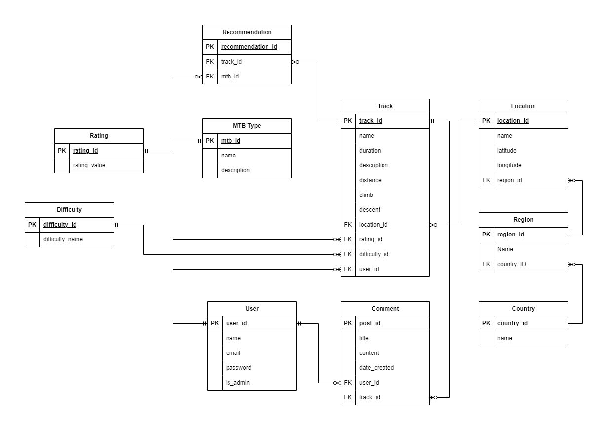

# Planning Documentation

Written by Jeevan Ng 

# GitHub Link

https://github.com/jeevanng/mountain_bike_api

# Overview 

This application will serve as a centralised platform for mountain biking enthusiasts to access comprehensive information about single track routes across the globe. 

# The Problem (R1)

Currently, the problem at hand is the lack of centralised platforms to access comprehensive information about mountain bike single track routes across the world. 

By creating an application with an API and a database, users can easily find suitable tracks based on their mountain bike type no matter where they are in the world. Whether they are on holiday overseas or looking for new tracks in their town, users will be able to find tracks and additional information (track descriptions, distance, duration etc.) at the tip of their fingers in one place. 

This application will aim to provide a centralised, user friendly and reliable hub for the mountain biking community. 

# Why is it a problem that needs solving? (R2)

This is a problem that needs solving as mountain bike enthusiasts are currently relying on various sources like online forums, word-of-mouth, magazines, websites and other applications to find information about tracks local to them. 

It is also incredibly difficult to find information on single track routes when travelling overseas. This is especially true since the information on forums, magazines and websites may be in a language that the user does not understand. 

Currently, the closest centralised application that exists is *Trailforks*, however, our application aims to provide unique features, enhanced functionalities and a better user experience. *Trailforks* is a clunky application and can be difficult to navigate when trying to find information on tracks. 

We have identified that mountain bike enthusiasts want a user friendly centralised platform to access all their mountain biking needs. They also wish to search tracks via different filters. This application aims to offer exactly that with added functionalities like the ability to populate a list of tracks that would be suitable to ride depending on the type of mountain bike. Further down the line, filters will be added to allow users to search for tracks by difficulty, duration, descent, climb etc. This functionality is currently not supported by *Trailforks*. 

# Why have you chosen this database system? What are the drawbacks? (R3)

The chosen database system is postgreSQL. PostgreSQL is a relational database management system which will best represent our data. It is one of the  most popular open-source relational databases known for it's robustness and has a large amount of active open-source contributors offering a built-in community support network. Being open-source, there are no licensing costs involved with using PostgreSQL which is a huge cost benefit as we are in the initial stages of developing our application. 

PostgreSQL supports international characters (if needed in the future) and is highly scalable in the quantity of data it can manage. This will helpful as this application develops further down the line as we will be adding hundreds of locations around the world with even more tracks. 

PostgreSQL is ACID (atomicity, consistency, isolation and durability) compliant, which basically ensures database transactions are processed reliably and consistently. The principles relate to transactional processing and are crucial for maintaining data integrity and recoverability in a predictable manner.

PostgreSQL has a large list of features such as support for a huge number of data types (numeric, boolean, datetime etc.), geometric types, monetary types and much more. PostgreSQL also supports spatial data which may be extremely beneficial further down in development as the ability to implement maps, contour lines and topographical images will be extremely attractive to users. 

Some of the drawbacks of PostgreSQL is that installation is complex and may prove challenging for beginners. The various complex features require more knowledge and expertise, and consequently for large scale deployments more training will be involved for the use of PostgreSQL in comparison to other simpler database systems. 

Another drawback is that PostgreSQL does not support horizontal scaling. This limitation means that as the load increases on PostgreSQL, there is no ability to distribute the workload across multiple machines (horizontally) to improve speed, efficiency and performance (Rathbone, 2023). As our application grows, we may need to look into other options that offer horizontal scaling, however, for the initial stages this will not be an issue. 

PostgreSQL also has limited noSQL features, which means that large amounts of unstructured data, such as data generated by social media (Rathbone, 2023), will not be able to be processed and stored. In the future our application will rely on user generated data for updates to tracks, new locations and foster a community that constantly contribute to the growth of the application. NoSQL's ability to to store and process unstructured data like posts, comments, likes, shares, user profiles etc. is a huge benefit over PostgreSQL. However, PostgreSQL is much more beneficial in the early stages of development and thus why it has been chosen. 

# Identify and discuss the key functionalities and benefits of Object-relational mapping (ORM) (R4)

Object-relational mapping is the bridge that connects object-oriented programming (OOP) to relational databases (Abba, 2021). 

In our application we will be using SQLAlchemy as our ORM tool, which will make it easier to develop the database as it simplifies the interaction between relational databases and different OOP languages. We are able to code in the programming language we are using instead of plain SQL. 

Some of the key functionalities of ORM are; 

1. Provides object-oriented tools
    - Allows the user to execute commands that would normally be executed on databases using SQL language, however, these commands can be executed in programming language of choice. 
2. Simplicity 
    - ORM are used due to it's simplicity in manage databases.
3. CRUD operations
    - Developers can perform data manipulation (CRUD) in relational databases. Developers don't have to use SQL language to create CRUD operations. 
    - ORM frameworks provide key functionality for CRUD operations, where the ORM will handle and translate these operations to the corresponding database. 
4. Object-Relational Mapping
    - The primary function of an ORM is to map objects in an OOP language to the correct tables and columns in a relational database. 

Some of the benefits of ORM tools are;

1. Reduced code complexity and improved readability compared to using strict SQL. 

2. Speeds up and decreases cost of development time (Abba, 2021).

3. Less code is written with ORM tools compared to SQL (Abba, 2021).

4. Implementation is simpler as ORM tools eliminate the need to manually convert between objects and tables. 

5. Minimal code changes when switching to a different database system. 

Some of the drawbacks are;

1. The initial stages of learning, installing and understanding ORM tools can be time-consuming.

2. ORMs generally tend to be slower than using SQL (Abba, 2021).

3. Database and SQL fundamentals are still required, so complete abstraction is not necessarily achieved. 

4. ORMs are not likely to perform better when complex queries are implemented or involved (Abba, 2021).

# Document all endpoints for your API (R5)

*localhost:8080/auth/register*

- This will register a new users.
- Requires email and password as a minimum

*localhost:8080/auth/login*

- User is able to login with details
- Requires email and password 

*localhost:8080/tracks* [GET]

- Get a list of all the tracks in the database

*localhost:8080/tracks/<<int:id>>* [GET]

- Get information on a particular track via track id 

*localhost:8080/tracks* [POST]

- Post a new track 

*localhost:8080/tracks/<<int:id>>* [DELETE]

- Delete a track via track id 

*localhost:8080/tracks/<<int:id>>* [PUT, PATCH]

- Edit/update track with PUT or PATCH method

*localhost:8080/tracks/<<int:id>>/comments* [POST]

- Post a new comment on a particular track via track id 

*localhost:8080/tracks/<<int:id>>/comments/<<int:comment_id>>* [DELETE]

- Delete comment via comment id, on a particular track via track id 

*localhost:8080/tracks/<<int:id>>/comments/<<int:comment_id>>* [PATCH]

- Edit/Update comment via comment id, on a particular track via track id 

*localhost:8080/difficulty* 

- Get a list of all difficulties

*localhost:8080/difficulty/<<int:id>>* 

- Get a list of tracks linked to a particular difficulty id. 
- Retrieve all tracks at a certain difficulty 

*localhost:8080/difficulty* [POST]

- Create new difficulty 

*localhost:8080/difficulty/<<int:id>>* [PUT, PATCH]

- Update the name of a difficulty via difficulty id 

*localhost:8080/difficulty/<<int:id>>* [DELETE]

- Delete a difficulty via id 

*localhost:8080/rating* 

- Get list of all ratings

*localhost:8080/rating* [POST]

- Create a new rating

*localhost:8080/rating/<<int:id>>* [PUT, PATCH]

- Edit/update an existing rating

*localhost:8080/rating/<<int:id>>* [DELETE]

- Delete an existing rating

*localhost:8080/country*

- Get a list of all countries

*localhost:8080/country* [POST]

- Create a new country

*localhost:8080/country/<country_name>* [DELETE]

- Delete a country by country_name

*localhost:8080/country/<country_name>*

- Get a list of regions associated to country_name

*localhost:8080/country/<country_name>/region/<region_name>*

- Get a list of locations from a particular region, region_name, which belongs to a certain country, country_name

*localhost:8080/country/<country_name>/region* [POST]

- Create a new region belonging to country_name

*localhost:8080/country/<country_name>/region/<region_name>*[DELETE]

- Delete a region via region_name, if it belongs to a country, country_name

*localhost:8080/country/<country_name>/region/<region_name>/location* [POST]

- Create a new location for the region, region_name, ensuring it exists in the country, country_name

*localhost:8080/country/<country_name>/region/<region_name>/location/<location_name>*

- Get all the tracks that belong to a certain location, location_name, if it belongs to the region, region_name, and if it exists within that country, country_name
- The location needs to exist in the region, and the region needs to exist in the country.
- E.g. If country_name is Australia;
    - Only regions such as Victoria, Tasmania etc will be valid. Whatever exists in the database.

*localhost:8080/country/<country_name>/region/<region_name>/location/W<location_name>* [DELETE]

- Delete a location and it's associated tracks.
- Must be linked to the correct region.
- Region must exist in the country.

*localhost:8080/mtb* 

- Get all the mountain bike types 

*localhost:8080/mtb/<<int:id>>* 

- Get all the recommended tracks for a certain type of mountain bike, id. 

**NOTE**

The countries, regions and locations would not normally have POST or DELETE methods, as these would normally be a list of dictionaries from a third party database.

The function to create and delete countries, regions and locations would normally be omitted, and the database will just have these pre-populated. This is because these values will not change and remain static. 

The ability to create and delete are only added to test the API's functionality. 

# ERD for the application (R6)

# Detail any third party services that your *app* will use (R7)

1. Flask 
    - Flask is a web framework for Python used to build web applications. It provides the architecture to develop web API's.
2. Flask-JWT-Extended 
    - This third party service is an extension of Flask and adds JSON Web Token (JWT) functionality to authenticate and authorise users.
3. SQLAlchemy 
    - This is the ORM library for Python. With this service, the developer is able to interact with databases and manage models with Python classes.
4. Marshmallow
    - Used for object serialisation and deserialisation. 
5. Psycopg2 
    - A PostgreSQL adapter for Python. Enables Flask to connect and interact with a PostgreSQL database.
6. PostgreSQL
    - Open-source relational database management system. 
    - Store and manage data for the API 
7. Flask Blueprint 
    - Help maintain and organise code by modularising application's routes and views
8. Bcrypt
    - Used for password hashing. 
    - Secure way to hash and verify passwords 

# Describe your projects *models* in terms of relationships they have with each other (R8)

Each entity will have a primary key. This enables us to establish relationships between two entities with the use of foreign keys.

A relational database built upon this model enables referential integrity, data integrity and enforces constraints. 

We are also able to retrieve information through these foreign keys and customise routes to handle different methods. 

1. Users
    - Contains primary key 
2. Comments
    - Contains primary key 
    - Will hold two foreign keys 
        - user_id
        - track_id
        - This is to identify that a particular comment belongs to a certain user (user_id) and track (track_id)
3. Tracks
    - Contains primary key 
    - Contains four foreign keys 
        - location_id
        - rating_id
        - difficulty_id
        - user_id
        - Identifies that a track belongs to a certain location, has a certain rating and difficulty and has been created by a particular user
        - The numerous foreign keys in this entity establish lots of relationships with other tables. This allows us to search different parameters and populate which tracks have the associated information.
        - As the tracks entity is probably the most useful for an end user, we want a user to be able to search for tracks through multiple methods, such as, difficulty, rating, location, mountain bike type etc. 
4. Countries
    - Contains primary key 
5. Regions
    - Contains primary key
    - Contains one foreign key
        - country_id
        - Foreign key will show which country it belongs to
6. Locations
    - Contains primary key
    - Contains one foreign key 
        - region_id
        - Identifies that it belongs to a certain region (region_id)
7. Difficulties
    - Contains primary key
8. Ratings
    - Contains primary key 
9. MTB Types
    - Contains primary key 
10. Recommendations 
    - Contains primary key 
    - Contains two foreign keys
        - mountain_bike_id
        - track_id
        - Used to identify which mountain bike types are recommended for certain tracks
        - Gives the ability to look up mountain bike type and get a list of which tracks are recommended for that bike 

# Discuss the database relations to be implemented in your application (R9)

Reference the ERD for a complete understanding.

The relationships implemented in the application are defined below;

1. User-Track
- One-to-many relationship 
- A user can have or create many tracks. A track can only belong to one user. 
- In the application, this user must be an admin

2. User-Comment
- One-to-many relationship 
- A user can create many comments
- A comment can only be linked/created by one user

3. Track-Comment
- One-to-many relationship
- A track can have multiple or many comments
- A comment can only belong or be posted on one track

4. Difficulty-Track
- One-to-many relationship
- A difficulty can be associated with zero or many tracks
- A track can only have one difficulty 

5. Rating-Track
- One-to-many relationship
- A rating can be associated with zero or many tracks
- A track can only have one rating

6. Country-Region
- One-to-many relationship
- A country can have zero or many regions
- A region can only belong to one country

7. Region-Location
- One-to-many relationship
- A region can have zero or many locations
- A location can only belong to one region

8. Location-Track
- One-to-many relationship
- A location can have zero or many tracks
- A track can only belong to one location

9. MTB Type-Recommendation
- One-to-many relationship
- A MTB type can have zero or many recommendations
- A recommendation can only have one MTB type 

10. Recommendation-Track
- One-to-many relationship
- A recommendation can only belong to one Track
- A track can have multiple or many recommendations (i.e. different mtb types recommended for the track)

# Describe the way tasks are allocated and tracked in your project (R10)

Tasks are allocated and tracked through an application called *Trello*. 

Link; https://trello.com/b/JIUllzQO/mountain-bike-api

Please visit link for full in depth allocation of tasks. Screen shots are just a snippet of what it looks like. 

# References

Abba, I. V. (2021, October 21). What is an ORM – The Meaning of Object Relational Mapping Database Tools [Review of What is an ORM – The Meaning of Object Relational Mapping Database Tools]. FreeCodeCamp. https://www.freecodecamp.org/news/what-is-an-orm-the-meaning-of-object-relational-mapping-database-tools/

Rathbone, M. (2023, February 8). PostgreSQL limitations [Review of PostgreSQL limitations]. Beekeeper Studio.
https://www.beekeeperstudio.io/blog/postgresql-limitations

